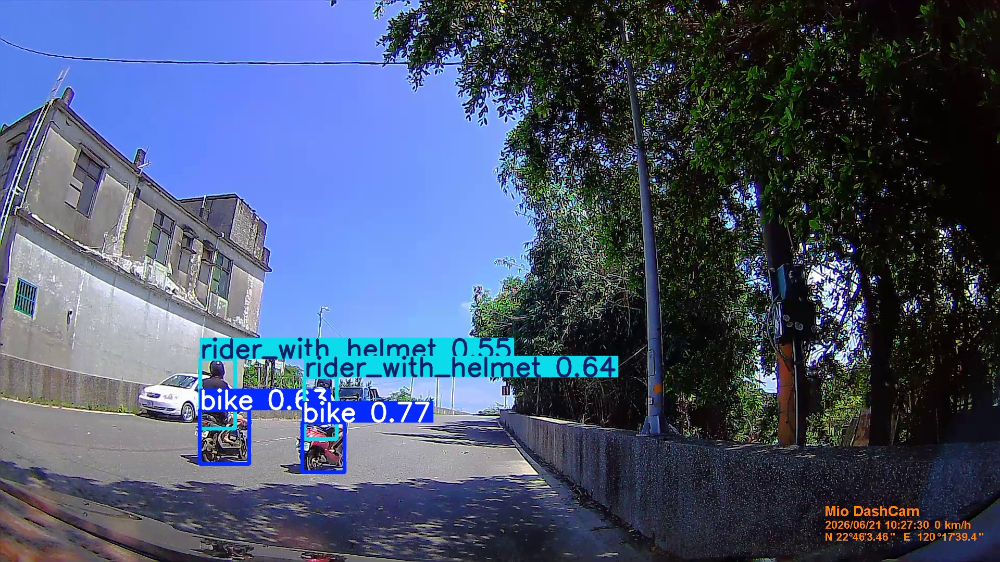
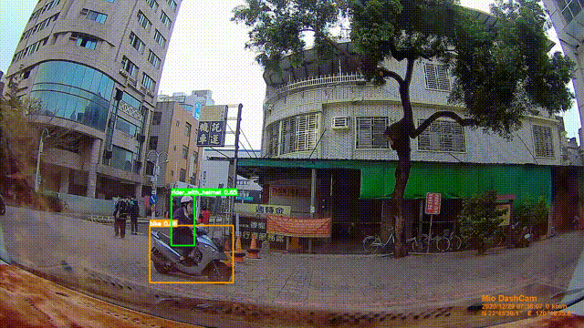
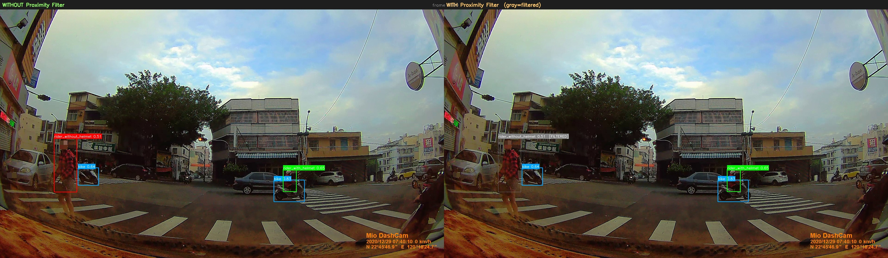

# 🛵 台灣道路安全帽辨識系統（Taiwan Motorcycle Helmet Detection）

> 使用 YOLOv8 遷移學習（Transfer Learning）建立台灣道路安全帽辨識系統，並透過資料品質改善、錯誤分析與模型迭代，將 mAP50 從 0.26 提升至 0.87。

🔗 **[線上 Demo]( 請填入 Streamlit Cloud 連結 )**

---

## 📌 專案動機

台灣道路上的機車數量極高，但公開安全帽偵測資料集多半來自國外場景，與實際道路環境存在明顯差異。

因此本專案以真實 dashcam 影像為基礎，重新建立符合台灣道路場景的三分類安全帽偵測系統：
- bike
- rider_with_helmet
- rider_without_helmet

並透過資料集迭代與後處理設計改善實際部署效果。

## 🎯 系統展示

| 圖片辨識 | 影片辨識 |
|---|---|
|  |  |

## 🖥️ Streamlit 互動展示

線上 Demo 包含四個功能分頁：

| 分頁 | 功能說明 |
|---|---|
| 📸 圖片測試 | 上傳街景或騎士圖片，即時顯示偵測結果；原圖與標注框並排比較 |
| 🎥 影片測試 | 上傳本地影片或使用內建範例，可調整 frame skip 速度；處理完成後可下載標注結果影片 |
| 📊 Model Performance | 展示 v1→v4 真實進步曲線（Data Leakage 修正後）及 v4 各類別詳細指標 |
| 🔍 Project Insights | Data Leakage 發現歷程、後處理邏輯迭代等開發心得 |

側邊欄可即時調整 Confidence 門檻值，並切換 **Bike Proximity Filter**（開啟時騎士偵測框需靠近機車才計入，以降低路人誤判雜訊）。

## 📊 關鍵成果

最終模型（v4）在乾淨驗證集（54 張，無 augmentation 混入）上達到：

| 指標 | 數值 |
|:---|:---:|
| mAP50 | 0.871 |
| mAP50-95 | 0.5475 |
| Precision | 0.8684 |
| Recall | 0.7539 |

### 四個版本的真實迭代曲線

開發過程中發現早期版本驗證集存在 data leakage，已用乾淨驗證集重新評估所有版本（詳見下方「開發歷程亮點」）：

| 版本 | Train 樣本數 | mAP50 | 關鍵改善 |
|:---:|:---:|:---:|:---|
| v1 | 165 | 0.2617 | 初版 3-class 架構 |
| v2 | 507 | 0.4207 | 補充 without_helmet 樣本 |
| v3 | 768 | 0.6007 | 補充白/彩色安全帽樣本 |
| v4 | **654** | **0.871** | ✅ 補充銀/灰背面視角 + 資料清洗 |

> **v3→v4 訓練樣本數反而減少 114 張，mAP50 卻提升 +0.27**，
> 說明效能增益來自針對性補強弱點類別與清洗雜訊，而非單純堆疊資料量。

## 🛠️ 技術架構

- **模型**：YOLOv8n，以遷移學習（Transfer Learning）為基礎，自訂 3-class（`bike` / `rider_with_helmet` / `rider_without_helmet`）
- **資料**：以自行蒐集之台灣及東南亞地區 dashcam 影像為主，搭配公開安全帽偵測資料集進行標注與補強。
      - 由於部分影像來源涉及第三方內容，本專案不提供資料集下載。
- **後處理**：Bike Proximity Filter，過濾不靠近任何機車的騎士偵測框，降低路人誤判為騎士的雜訊
- **展示介面**：Streamlit（圖片/影片測試 + 模型效能展示）

```
輸入影像/影片
      ↓
YOLOv8 推論（3-Class Detection）
      ↓
Bike Proximity 過濾（雙 class 幾何後處理）
      ↓
輸出安全帽辨識結果
```

## 🔍 開發歷程亮點

### 1️⃣ 發現並修正 Validation Data Leakage

檢視 v2、v3 的資料處理流程時，發現驗證集存在 Data Leakage：augmented 圖片在切分 train/valid 前即已產生，導致同一張原圖的不同增強版本可能分別落入 train 與 valid，使 mAP 數字過於樂觀。

檢查結果發現資料重疊率如下：

- v1：7.5%
- v2：15.1%
- v3：24.5%

進一步追查後發現，v2 資料擴充時誤將 augmented 圖片納入資料集，導致資料重疊問題延續至後續版本，因此重新建立乾淨驗證集並重新評估所有版本。

### 2️⃣ 後處理過濾邏輯的迭代

初版只對 `rider_without_helmet` 套用 proximity filter（因為這是誤判代價較高的警示類別），但實測影片時發現路人也會被誤判為 `rider_with_helmet`，因此將過濾範圍擴大為雙 class，持續用真實場景測試結果修正設計，而非單純依賴驗證集指標。



> 左側為原始模型輸出，右側套用過濾後，不靠近任何機車的偵測框（灰色）被自動移除。畫面中真正的機車騎士（綠框）仍完整保留。

## ⚠️ 已知限制

- 模型對未見過的相似類別（如棒球帽、鴨舌帽）容易誤判為已戴安全帽
- 低解析度/動態模糊畫面下，遠距小目標辨識率下降
- 騎士視角（非車用 dashcam 視角）表現較差，屬於 domain mismatch，訓練資料以車用視角為主
- 腳踏車有時被誤判為機車，因訓練資料缺乏腳踏車負樣本

## 🚀 Future Work

- 補充帽類負樣本（棒球帽、鴨舌帽等），降低跨類別誤判
- 補充腳踏車負樣本或新增獨立 class
- 評估模型於夜間場景的表現
- 蒐集低光源訓練資料並進行補強
- 引進 ByteTrack 做多目標追蹤與車流統計

## 📄 License

本專案程式碼採用 [MIT License](LICENSE)。  
模型權重（`best_3class_v4.pt`）訓練資料來源包含第三方資料集，僅供學術與展示用途。
